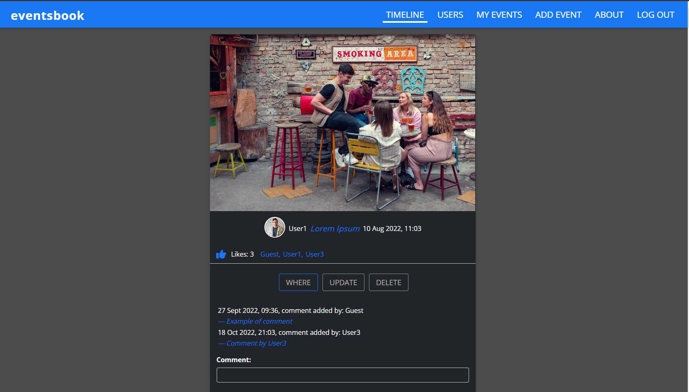
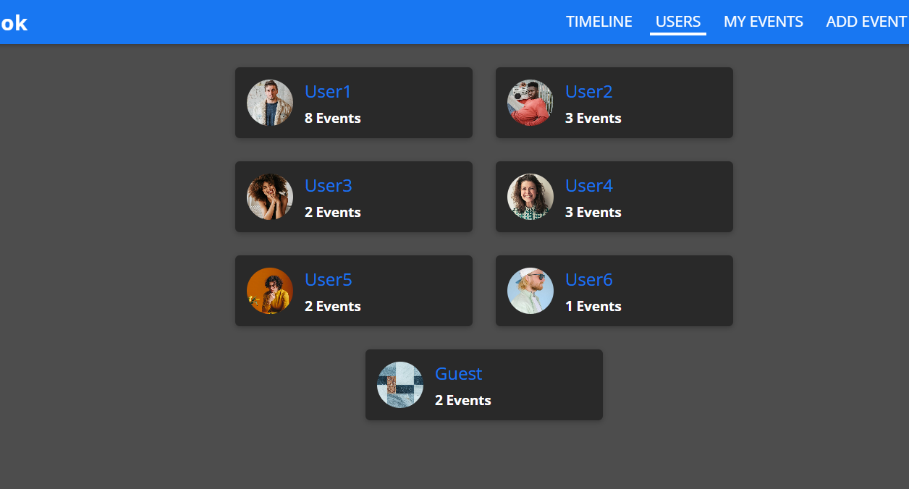
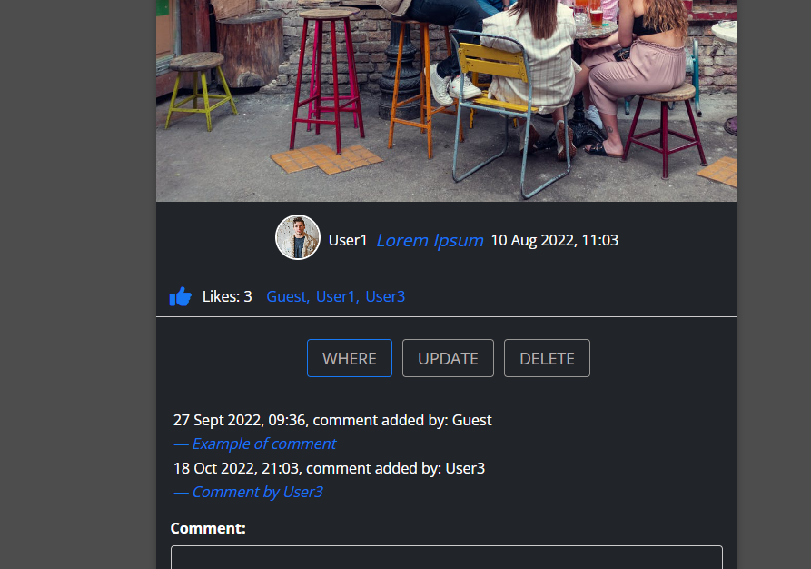

<a name="readme-top"></a>

<!-- PROJECT LOGO -->
<br />
<div align="center">

  <p>
    'eventsbook' is a full stack app - this repository contains its frontend source code while
    the backend source code is stored in 
    <a href="https://github.com/spatulatom/backend-eventsbook">
    another GitHub repository  here »</a>
    <br />
    <br />
    <a href="https://eventsbook-91260.web.app/allevents"><strong>View the deployed app »</strong></a>
    <br />
    <br />
   
  </p>
</div>

<!-- TABLE OF CONTENTS -->
<details>
  <summary>Table of Contents</summary>
  <ol>
    <li><a href="#about-the-project">About The Project</a></li>
    <li><a href="#built-with">Built With</a></li>
    <li><a href="#migration-from-react-18-to-react-19">Migration from React 18 to React 19, including React DOM</a></li>
    <li><a href="#migration-from-react-router-v5-to-v6">Migration from React Router v5 to v6</a></li>
    <li><a href="#migration-from-react-router-v6-to-v7">Migration from React Router v6 to v7</a></li>
    <li><a href="#acknowledgments">Acknowledgments</a></li>
  </ol>
</details>

<!-- ABOUT THE PROJECT -->

## About The Project

1. This app is a social media platform where users can:

- log in/create an account,
- upload photos/create posts (about upcoming social events),
- add likes,
- add comments,
- tag their event's location on the Google map ,
- change their passwords.



2. There are currently a few dummy users accounts created and all of them users have already posted some events as seen below:



3. Below we have an example of an event created by User1

- titled 'Lorem Ipsum'
- with the date and time of the creation
- it received 3 likes by Guest, User1 and User3
- by using the three buttons the event can be seen on Google Maps,
  Updated or Deleted
- there were two comments made by Guest and User3



<p align="right">(<a href="#readme-top">back to top</a>)</p>

### Built With

- HTML, CSS,
- [![React][react.js]][react-url],
- Node.js, Express.js, Mongoose,
- MongoBD for a database,
- Firebase for deploying the frontend,
- Render.com for deploying the backend,
- Cloudinary API for storing photos,
- Google Maps Platform API for events locations (due to having to use laser card on Google Maps this
  feature is temporarly on hold),
- SendGrid API for password change,
- Multer middleware library for uploading photos,
- bcrypt library for hashing passwords,
- jsonwebtoken for creating login token,
- Chrome Developer Tools for testing screen sizes and using Lighthouse,
- Chrome, Firefox, Edge and Opera for browser testing the responsiveness,
- https://ui.dev/amiresponsive for testing and to make responsive image,
- https://favicon.io/favicon-generator/ to create a favicon,
- https://fontawesome.com/ for icons,
- https://tinypng.com/ to optimize images,
- https://www.remove.bg/ for removing images backgrounds,
- https://chrome.google.com/webstore/detail/pesticide-for-chrome-with/neonnmencpneifkhlmhmfhfiklgjmloi during development,
- https://wave.webaim.org/ to check web accessibility,
- https://balsamiq.com/ for wireframing.

Heavy usage of React Hooks like useReducer for managing complex state and useContext (as a part of the Context API that is being used for a "global" state managment) also useEffect, useRef, useCallback and useState. There are also custom hooks built and that is form-hook.js for managing form data, http-hook.js for all fetching requests and auth-hook.js for managing back end login token through the rerender cycles.
All sorts of errors that are being handled on the backend  (like an incorrect password) are sent to the frontend and are displayed in a modal window on UI for better UX.
As for the CSS styling, Block/Element/Modifier convention is being followed.

<p align="right">(<a href="#readme-top">back to top</a>)</p>

<!-- ACKNOWLEDGMENTS -->

## Migration from React 18 to React 19

Successfully upgraded from React 18.3.1 to React 19.0.0, including React DOM.

### Steps Completed:

1. **Created backup before migration**

   ```bash
   copy package.json package.json.backup-$(Get-Date -Format "yyyyMMdd-HHmmss")

   ```

2. **Updated React and React DOM packages**
   npm install --save-exact react@19.0.0 react-dom@19.0.0
   npm install --save-exact @types/react@^19.0.0 @types/react-dom@^19.0.0

3. **Ran official React 19 migration codemod**
   npx codemod@latest react/19/migration-recipe

4. Fixed React Transition Group compatibility issues

Added nodeRef pattern to all CSSTransition components
Updated components to use useRef for proper DOM node handling:
// Before (React 18)
<CSSTransition
in={props.show}
timeout={200}
classNames="modal"

> <ModalOverlay {...props} />
> </CSSTransition>

// After (React 19)
const nodeRef = useRef(null);
<CSSTransition
nodeRef={nodeRef}
in={props.show}
timeout={200}
classNames="modal"

>

  <div ref={nodeRef}>
    <ModalOverlay {...props} />
  </div>
</CSSTransition>
Key Changes:
✅ Updated entry point to use createRoot instead of render
✅ Fixed compatibility with react-transition-group using refs
✅ Removed usage of deprecated APIs like findDOMNode
✅ Maintained component functionality while improving performance

## Migration from React Router v5 to v6

Correctly implemented:

The new route structure with <Routes> and <Route> components
Using the element prop instead of children components

- Replacing Redirect with Navigate
- Replacing Switch with Routes
  Using the catch-all route with path="_" for fallback navigation
  Key Improvements in Your Updated Code
  ✅ Proper imports: import { Routes, Route, Navigate } from 'react-router-dom'
  ✅ Route structure: Each route uses element={<Component />} pattern insted of  
  <Route path="/events/new" exact>
  <NewEvent />
  </Route>
  ✅ Conditional routes: Different routes for authenticated vs non-authenticated users
  ✅ Fallback handling: Using <Route path="_" element={<Navigate to="/allevents" />} />
  Next Steps
  Now that your router is working, you might need to update any components that use router-specific hooks:

Replace useHistory() with useNavigate()

Check any components using location or route params:

useParams() still works but might return data differently
useLocation() still works similarly
useRouteMatch() is replaced with useMatch()
If you were using nested routes, the approach is different in v6 with <Outlet />

## Migration from React Router v6 to v7

Successfully upgraded from React Router DOM v6 to v7.3.0, with key architectural changes.

### Steps Completed:

1. **Updated React Router Package**

   ```bash
   npm install react-router-dom@latest

   ```

2. **Migrated to Data Router API**

Replaced <BrowserRouter> and <Routes> with createBrowserRouter and RouterProvider
Configured routes using JavaScript objects instead of JSX component
// Before (React Router v6)
<BrowserRouter>
<Routes>
<Route path="/allevents" element={<AllEvents />} />
</Routes>
</BrowserRouter>

// After (React Router v7)
const router = createBrowserRouter([
{
path: "/",
element: <Root />,
children: [
{ path: "allevents", element: <AllEvents /> }
]
}
]);

<RouterProvider router={router} />

3. **Implemented Layout Pattern with Outlet**
   const Root = () => {
   return (
   <>
   <MainNavigation />
   <main>
   <Outlet />
   </main>
   </>
   );
   };

4. **Updated Navigation after Form Submissions**

Added explicit navigation with useNavigate() hook after successful operations
const navigate = useNavigate();

const placeSubmitHandler = async (event) => {
event.preventDefault();
try {
await sendRequest(/_ API request details _/);
navigate("/"); // Explicit navigation
} catch (err) {}
}; 5. **Configured Conditional Routes Based on Authentication**
const router = createBrowserRouter([
{
path: "/",
element: <Root />,
children: token ? [
// Authenticated routes
] : [
// Non-authenticated routes
]
}
]);

Key Benefits:
✅ Improved performance with the data router architecture
✅ Enhanced type safety and better TypeScript support
✅ More explicit navigation control with programmatic redirects
✅ Better code organization with object-based route definitions
✅ Support for future React Router features and patterns

## Acknowledgments

- this project was completed at the end of the Udemy course <a href="https://www.udemy.com/course/react-nodejs-express-mongodb-the-mern-fullstack-guide/learn/lecture/16833284?start=15#overview">The MERN Guide</a>

- all users' accounts and all events have been created with the usage of free-to-use photos from www.pexels.com

<p align="right">(<a href="#readme-top">back to top</a>)</p>

<!-- MARKDOWN LINKS & IMAGES -->

[linkedin-shield]: https://img.shields.io/badge/-LinkedIn-black.svg?style=for-the-badge&logo=linkedin&colorB=555
[linkedin-url]: https://www.linkedin.com/in/tomasz-s-069249244/
[product-screenshot]: images/screenshot.png
[next.js]: https://img.shields.io/badge/next.js-000000?style=for-the-badge&logo=nextdotjs&logoColor=white
[next-url]: https://nextjs.org/
[react.js]: https://img.shields.io/badge/React-20232A?style=for-the-badge&logo=react&logoColor=61DAFB
[react-url]: https://reactjs.org/
[vue.js]: https://img.shields.io/badge/Vue.js-35495E?style=for-the-badge&logo=vuedotjs&logoColor=4FC08D
[vue-url]: https://vuejs.org/
[angular.io]: https://img.shields.io/badge/Angular-DD0031?style=for-the-badge&logo=angular&logoColor=white
[angular-url]: https://angular.io/
[svelte.dev]: https://img.shields.io/badge/Svelte-4A4A55?style=for-the-badge&logo=svelte&logoColor=FF3E00
[svelte-url]: https://svelte.dev/
[laravel.com]: https://img.shields.io/badge/Laravel-FF2D20?style=for-the-badge&logo=laravel&logoColor=white
[laravel-url]: https://laravel.com
[bootstrap.com]: https://img.shields.io/badge/Bootstrap-563D7C?style=for-the-badge&logo=bootstrap&logoColor=white
[bootstrap-url]: https://getbootstrap.com
[jquery.com]: https://img.shields.io/badge/jQuery-0769AD?style=for-the-badge&logo=jquery&logoColor=white
[jquery-url]: https://jquery.com
